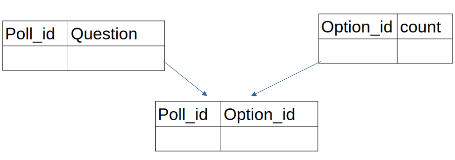
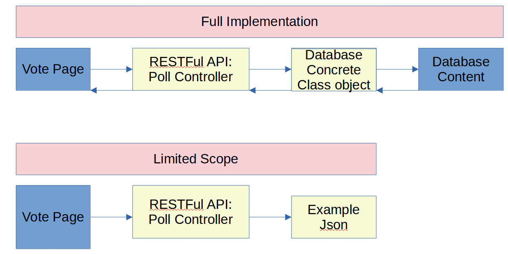
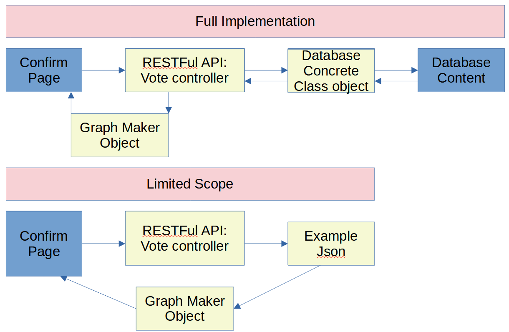

# techtest2_pollapi

# Introduction
 My submission for a tech test to produce a web application with a RESTful API in limitied scope.  
## Requirements 
**Web Application**:
1. **Voting page:**  
   a. To get poll.  
   b. Display poll options.  
   c. Allows user to select and submit a vote.  
      i. Highlights option selected.  
     ii. Selection check before submitting.  
3. **Confirmation page**    
   a. Show thank you message.  
   b. Display percentage of votes for the options.  
       i. Results order in descending.  
      ii. Percentages should have no decimals  

**RESTful API**
1. GET poll to be displayed.  
2. POST a vote of what option user has selected.  
3. GET votes for a poll by poll's id.

# How to Run and Folder and File Structure 
## Main Folder Structure  
* Classes# Contains all internal classes and functions created for project.
   * /abstract_classes.py # Contains abstract classes for project.
   * /utility.py # Contains all concrete classes or utility functions.
* Resources # Contains example json.
* Static #Contains css and images.
* templates # contains hmtl files
* tests/ Contains test files
  * /test_polls_api.py # tests for polls micro-controller.
  * /test_utility.py # tests for concrete classes and utility functions.
  * /test_votes_api.py # tests for votes micro-controller.
* requirements.txt #text file for needed libraries.
* **api.py** The Restful API driver file.
* **webapp.py** The web application driver file.  

## How to Run Project
1. Install libraries in the **requirements.txt** using pip in VSC.
2. In one terminal type **python api.py**. You need to run API first before web app.
3. In a new terminal type **python webapp.py**. Then click on the server to automatically open up a browser.

## How to Run Tests
1. In one terminal type **python api.py**. You need to run API so you can test it.
2. Run all tests type in the same terminal type **pytest -svv**.

# Project Stack Choice
* **Python**
   * Python is my main language and therefore the most comfortable. However I understand that means front end's output is not as flexible using languages like JavaScript with React.
* **Flask / Flask RESTFul for  building API and Web Application**
   1. Flask is a light weight web development framework perfect for limited scope / smaller development projects. Since this is limited scope with no obvious admin functions then Django would've not contributed positively to the one week timelimit.
   2. Flask itself does support RESTFul API with good documentations.
   3. These two are industry standard tools within the python ecosystem.
* **Pytest for testing**
   1. Pytest offers good functionalities for unit testing such as fixtures which is equivalent of 'inlinedata' in C#. Allowing you to have test inputs as well as even mock objects.
   2. Pytest also offers easier and simplier assertion statements.
* **Bootstrap**
   1. Easier ways to implement certain features and upgrading the aesthetic of a web app.
* **Plotly for ploting**
   1. Dedicated library to plot information that also uses javascript to extend the capabilities of Python.

# My Implementation
## API Highlights
1. **I decided to split my RESTFul API into two micro-controllers because I assume that votes and polls table will be linked by a link table. Many smaller tables instead of big tables for speed.** 
   * Poll Class that specifically deals with the poll database tables.
   * Vote Class that specifically deals with the votes databas tables.
   * Note that due to the limited scope of the brief, I changed to example JSON file to include {count} which tells you how many counts exist within an option.

2. **I decided to create an abstract class called data source to follow the dependency inversion principle of SOLID. This class was created but not instantiated due to project scope but I feel it is good to demonstrate.**
   * There maybe many types of databases so therefore API couples with abstract class.
   * The connection of database, exectuing querying and even searching is then done within the database class NOT the micro-service classes.
 

3.**I also created an abstract class for graphs as there could be a lot of different types of graphs implemented. A concrete class for horizontal bar chart was used in the project**
  * This allows encapsulation of graph tweaking away from everything else.

4.**Within the API Vote class I added a constructor that is a list. This list then appends any POST resources carried out and therefore now the POST resource is in memory.** 
  * Within the API terminal you can see that when POST vote is used up, the in memory json file count updates to whatever the user has inputed. This is automatically printed in the API terminal.

## Web  App Highlights
1.**If no selection is submitted, clicking the submission button will reload vote page and not trigger any API call**  
2.**Graph used is a fully interactive graph**   
3.**All HTML elements are sized to viewport for better device scaling**   
4. **HTML elements all inherit from a base template to allow better management of html files** 

## Testing
1. Unit testing was carried out for any utility functions used.
2. Backend API calls were tested however due to the limited scope testing was limited.
3. Front end testing was done mostly end to end.
4. Mobile view were tested on edge device emulation

# Project Evaluation
There were some limitations which I would have wanted to improve on given more time.
1. **Better TDD for backend using mock objects**
     * I could've used mock objects to mock a concrete data source class. Therefore allowing me to tests specific cases such as:
          * If connection could not be made.
          * Id not found in query
          * Unforseen return errors from database.
2. **Slow speed in producing graph**
   * Because the graph produced is an interactive graph it takes a bit of time to produce it, there could be alternative ways of not using the full grpah html.
3. **Error handling at front end**
   * Front end testing was lacking and so I could've added http status codes that could display specific type of errors such as:
       * Poll id not found
       * Post failure
       * Post success
4. **General refactoring**
    * I can refactor the code a lot better as function for submitting had to do a lot which could've been abstracted into the backend. 

# Deployment 
1. **If deploying**  
 a. The best way could be deploying it via cloud using virtual machines. However this will require some cost and therefore maybe easier than a server but more expensive.     
 b. Since the API directly interacts with database security implementations would need to be used such as the concrete datasource class details need to be within a config file or stored somewhere else.     
 c. Since the frontend is accessing API, then access policy maybe needed to retrict who can modify the data.      

